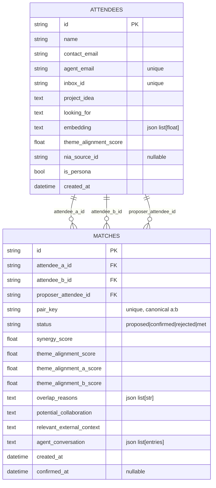
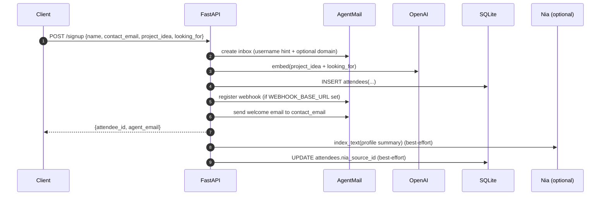
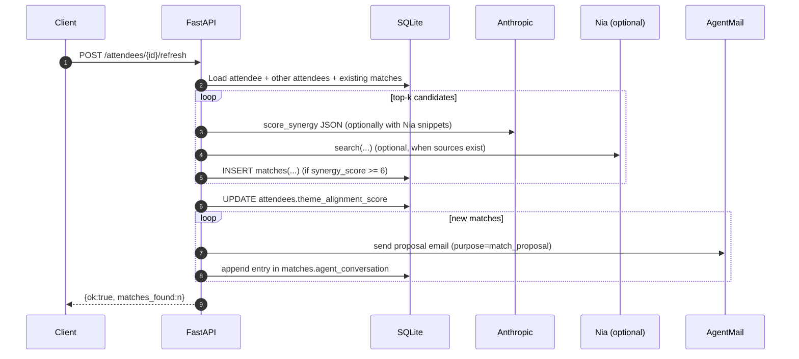
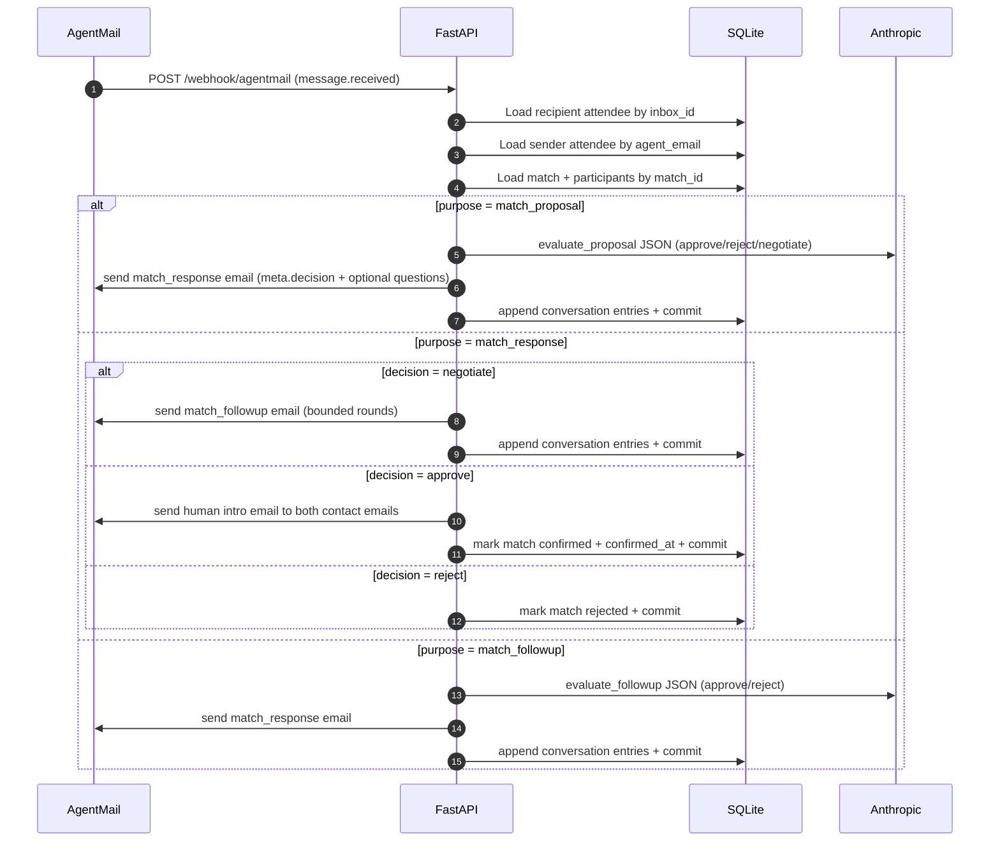

# HackMatch Backend

FastAPI backend for HackMatch: it signs up attendees, provisions an AgentMail inbox per attendee, generates candidate matches (embeddings + LLM scoring), and runs an agent-to-agent email negotiation loop before sending humans an intro.

## How it works (HLD)

```mermaid
flowchart LR
  FE[Frontend (localhost:3000)] -->|HTTP| API[FastAPI Backend]

  API --> DB[(SQLite via SQLAlchemy)]
  API --> AM[AgentMail API]
  API --> OA[OpenAI Embeddings]
  API --> AN[Anthropic LLM]
  API --> NIA[Nia API (optional)]

  AM -->|webhook: message.received| API
```

### Core ideas

- Every attendee gets an **AgentMail inbox** (`Attendee.inbox_id` + `Attendee.agent_email`).
- Matching is a two-step pipeline:
  1) retrieve candidates via **embedding cosine similarity** (OpenAI embeddings)
  2) filter/score via **LLM JSON evaluation** (Anthropic) and store a `Match`
- For good matches, the backend sends a **proposal email** from one attendee agent to the other.
- AgentMail webhooks drive the **negotiation loop** and (on approval) trigger a **human intro email** to both `contact_email`s.

## Data model (LLD)



## Key flows (LLD)

### Signup

`POST /signup` provisions an inbox, stores the attendee row, optionally registers a webhook, and optionally indexes the attendee in Nia.



### Matching refresh

`POST /attendees/{id}/refresh` computes up to 5 embedding-nearest candidates, calls an LLM JSON scorer, persists matches (deduped via `pair_key`), then emails proposals for newly created matches.



### Agent negotiation loop (via AgentMail webhook)

Agent-to-agent emails are tagged with a `---HACKMATCH-META---` block containing `purpose` + `match_id` (see `utils/email_format.py`).



## API surface

- `GET /health` → `{ "ok": true }`
- `POST /signup` → creates attendee + AgentMail inbox
- `GET /attendees/{attendee_id}` → attendee details
- `POST /attendees/{attendee_id}/refresh` → computes new matches + sends proposals
- `GET /attendees/{attendee_id}/matches` → list of matches (sorted by synergy score)
- `GET /attendees/{attendee_id}/activity` → email activity derived from `Match.agent_conversation`
- `POST /matches/{match_id}/met` → mark a match as met
- `POST /webhook/agentmail` → AgentMail webhook receiver (async background processing)

## Local development

### 1) Install and run

From `backend/`:

```bash
python3 -m venv .venv
source .venv/bin/activate
pip install -r requirements.txt
uvicorn main:app --reload --port 8000
```

If running from repo root, use:

```bash
uvicorn backend.main:app --reload --port 8000
```

### 2) Configure env

Copy `backend/.env.example` → `backend/.env`.

Required for core flows:

- `AGENTMAIL_API_KEY` (provision inboxes + send email + webhooks)
- `OPENAI_API_KEY` (embeddings)
- `ANTHROPIC_API_KEY` (LLM reasoning)

Optional:

- `NIA_API_KEY` (+ `NIA_API_URL`) to index/search context for richer match scoring
- `DATABASE_URL` (defaults to `sqlite:///./hackmatch.db`)
- `WEBHOOK_BASE_URL` (public URL that AgentMail can hit for webhooks)
- `AGENT_DOMAIN` (non-default AgentMail domain; defaults to `agentmail.to`)

## Webhook setup (AgentMail)

To receive `message.received` events locally, you need a public URL that forwards to the backend.

- Set `WEBHOOK_BASE_URL` to your tunnel base (e.g. ngrok)
- The backend registers webhooks pointing to: `WEBHOOK_BASE_URL + /webhook/agentmail`
- Re-register existing attendees/inboxes via:

```bash
python repair_agentmail_webhooks.py
```

## Nia context bootstrap (optional)

This repo can index a few shared sources (event description + external docs) and store the resulting source IDs in `backend/.nia_sources.json`. The matching service reads this file best-effort.

```bash
python setup_nia_context.py
```

## Seeding demo attendees

Creates (or updates) a set of seeded attendee profiles and ensures webhooks + Nia indexing best-effort.

```bash
python seed_demo_profiles.py
```

## Seeding persona attendees (via API)

Signs up a larger set of canned “persona” attendees by calling the running backend (`BACKEND_BASE_URL`, default `http://localhost:8000`) and then marks those rows as `is_persona=true`.

```bash
python seed_personas.py
```

## Notes / gotchas

- CORS is currently configured to allow `http://localhost:3000` only (`backend/main.py`).
- `backend/routes/webhooks.py` currently ignores human-to-agent emails (non-agent senders) and only processes agent-to-agent negotiation emails.
